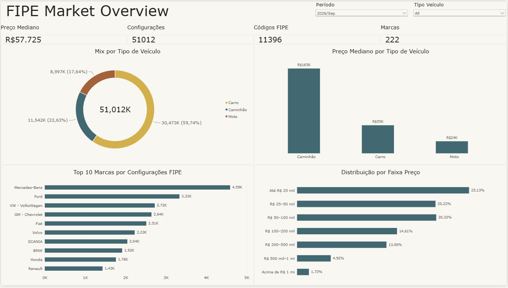
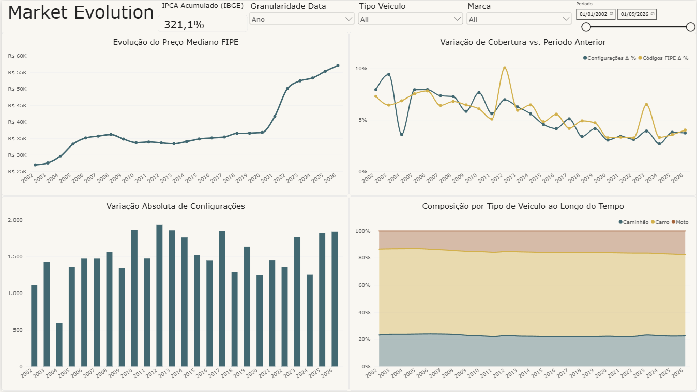
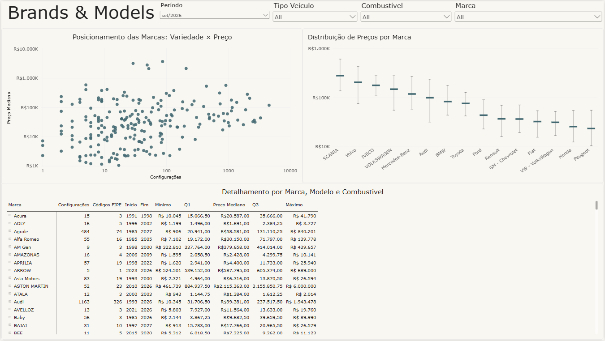
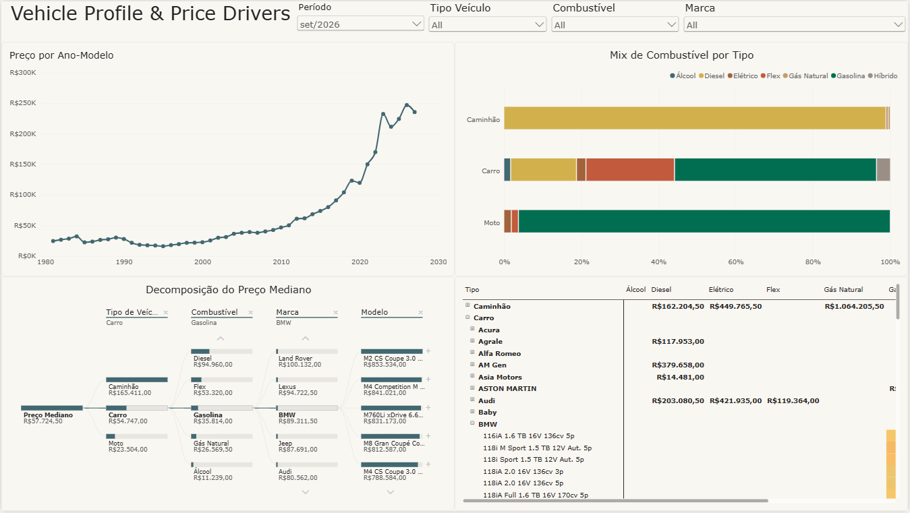

# FIPE Data Pipeline

End-to-end Data Engineering and Analytics project for ingesting, validating,
transforming, modeling, querying, and visualizing historical Brazilian FIPE
vehicle pricing data.

The project combines:

- incremental ingestion from FIPEX GitHub Releases;
- historical backfill from January 2001 onward;
- deterministic data-quality validation;
- quarantine and duplicate auditing;
- Medallion Architecture;
- partitioned Parquet storage;
- a Gold Star Schema;
- DuckDB as the analytical SQL layer;
- automated tests and CI;
- a version-controlled Power BI Project (`.pbip`);
- official IPCA inflation context for financial interpretation.

The current FIPE dataset covers **January 2001 through September 2026**.

---

# Dashboard Preview

The Power BI report is stored as a version-controlled PBIP project under
`powerbi/`.

## Market Overview

Single-period snapshot of the FIPE market, including median price, current
vehicle configurations, FIPE codes, brands, vehicle-type mix, leading brands,
and price-range distribution.



## Market Evolution

Longitudinal analysis with dynamic Month / Quarter / Year granularity,
including median-price evolution, FIPE coverage growth, absolute configuration
change, vehicle-type composition, and accumulated official IPCA inflation.



## Brands & Models

Exploratory brand positioning using price and portfolio breadth, price
distribution through median and interquartile range, and detailed
brand/model/fuel drill-down.



## Vehicle Profile & Price Drivers

Cross-sectional exploration of model year, fuel mix, price segmentation by
vehicle type and fuel, and interactive decomposition of median price.



> A public interactive Power BI link will be added after the report is
> published to Power BI Service.

---

# 1. Architecture

```text
FIPEX GitHub Releases
        |
        v
+----------------------+
|        Bronze        |
| raw monthly Parquet  |
+----------------------+
        |
        | validate.py
        | transform.py
        v
+----------------------+
|        Silver        |
| trusted partitions   |
| year=YYYY/month=MM   |
+----------------------+
        |
        | gold.py
        v
+----------------------------------+
|          Gold Star Schema        |
|                                  |
|  dim_date.parquet                |
|  dim_vehicle.parquet             |
|  fct_fipe_prices.parquet         |
+----------------------------------+
        |
        | DuckDB
        v
+----------------------+
| Analytical SQL Layer |
| Parquet-backed views |
+----------------------+
        |
        | ODBC / Import
        v
+----------------------+
|      Power BI        |
| Semantic + Analytics |
+----------------------+
        |
        +--> Official IPCA context
             (IBGE via BCB SGS)
```

Auxiliary outputs:

```text
Invalid rows       -> data/quarantine/
Removed duplicates -> data/quarantine/duplicates/
DuckDB catalog     -> data/fipe.duckdb
Logs               -> logs/fipe_pipeline.log
```

---

# 2. Data Sources

## FIPE vehicle pricing

The primary source is the FIPEX dataset:

```text
https://github.com/fipex-labs/dataset
```

The pipeline intentionally selects:

```text
fipex-prices-latest.parquet
```

and excludes:

```text
fipex-prices-latest-merged.parquet
```

This preserves historical source naming instead of retroactively replacing
historical labels with merged/current labels.

## Official inflation context

The Power BI semantic model also includes monthly official Brazilian IPCA
inflation data.

The report uses the IPCA series published by the Brazilian Central Bank SGS
with IBGE as the official statistical source:

```text
BCB SGS series 433
https://api.bcb.gov.br/
```

IPCA is treated as a separate monthly analytical fact related to the date
dimension.

Accumulated inflation is **compounded across monthly rates** rather than
calculated as a simple arithmetic sum.

---

# 3. Incremental Strategy

FIPEX publishes full historical snapshots.

This project converts that upstream snapshot model into a local incremental
architecture:

1. discover available GitHub Releases;
2. identify missing FIPE reference months;
3. temporarily download the required full FIPEX snapshot;
4. filter only the requested reference month;
5. persist one monthly Bronze file;
6. validate and transform the new data;
7. write one trusted Silver partition;
8. quarantine invalid or ambiguous records;
9. audit removed exact duplicate copies;
10. rebuild the Gold dimensional model only when required;
11. refresh the persistent DuckDB analytical catalog;
12. expose the updated Star Schema to Power BI.

Monthly Bronze files:

```text
data/bronze/monthly/fipe_YYYY_MM.parquet
```

Silver partitions:

```text
data/silver/year=YYYY/month=MM/fipe.parquet
```

The workflow is idempotent: existing Bronze and Silver periods are not
reprocessed unnecessarily.

---

# 4. Medallion Layers

## Bronze

Raw source data with minimal intervention.

```text
data/bronze/
├── historical/
└── monthly/
```

The historical source is used for the initial bootstrap.

## Silver

Validated, standardized, trusted monthly partitions:

```text
data/silver/
└── year=2026/
    └── month=09/
        └── fipe.parquet
```

Silver preserves historical source labels and supports localized reprocessing.

## Gold

Gold is an analytical Star Schema rather than a wide denormalized table:

```text
data/gold/
├── dim_date.parquet
├── dim_vehicle.parquet
└── fct_fipe_prices.parquet
```

These three artifacts are the BI-facing FIPE model.

---

# 5. Logical Grain

The trusted Silver observation grain is:

```text
ano_referencia
+ mes_referencia
+ codigo_fipe
+ ano_modelo
+ sigla_combustivel
```

Equivalent Python definition:

```python
GRAIN_COLUMNS = [
    "ano_referencia",
    "mes_referencia",
    "codigo_fipe",
    "ano_modelo",
    "sigla_combustivel",
]
```

`zero_km` is functionally related to `ano_modelo`:

```text
ano_modelo IS NULL <=> zero_km = True
```

Brand and model names are intentionally excluded from the Silver grain because
historical descriptive labels can evolve for the same FIPE business entity.

Fuel remains part of the grain because the same FIPE code can legitimately
appear with different fuel variants.

---

# 6. Gold Star Schema

The Gold layer contains one fact table and two dimensions:

```text
              dim_date
                  1
                  |
                  *
          fct_fipe_prices
                  *
                  |
                  1
             dim_vehicle
```

## `dim_date`

One row per FIPE reference month.

```text
date_key
ano_referencia
mes_referencia
ano_mes
trimestre
nome_mes
```

`date_key` uses `YYYYMM`.

Example:

```text
202609
```

## `dim_vehicle`

One row per analytical vehicle configuration.

```text
vehicle_key
codigo_fipe
nome_marca
nome_modelo
tipo_veiculo
ano_modelo
zero_km
sigla_combustivel
nome_combustivel
```

Vehicle natural key:

```text
codigo_fipe
+ ano_modelo
+ zero_km
+ sigla_combustivel
```

### Surrogate `vehicle_key`

`vehicle_key` is a technical numeric surrogate key (`BIGINT` / `int64`) with
no embedded business meaning.

The key is generated deterministically using row-number semantics after sorting
the natural vehicle key:

```text
sort natural vehicle key
-> assign 1, 2, 3, ...
```

This produces a compact single-column relationship key for Power BI.

## Historical descriptive labels

Historical source labels remain preserved in Silver.

`dim_vehicle` keeps the latest trusted descriptive label for each vehicle
natural key, behaving as a simple SCD Type 1 analytical dimension.

## `fct_fipe_prices`

Fact grain:

> One FIPE price for one analytical vehicle configuration in one FIPE
> reference month.

Columns:

```text
date_key
vehicle_key
valor_centavos
```

Primary key:

```text
date_key + vehicle_key
```

Relationships:

```text
fct_fipe_prices.date_key
    -> dim_date.date_key

fct_fipe_prices.vehicle_key
    -> dim_vehicle.vehicle_key
```

---

# 7. Current Dataset Coverage

After the historical bootstrap and the September 2026 incremental load:

```text
FIPE coverage:        2001-01 -> 2026-09
Reference periods:    309
Fact rows:            9,528,944
Vehicle dimension:    59,582 rows
Date dimension:       309 rows
```

September 2026 snapshot:

```text
Vehicle configurations:  51,012
Distinct FIPE codes:      11,396
Median FIPE price:        R$ 57,724.50
```

Historical bootstrap:

```text
Coverage:          2001-01 -> 2026-08
Reference months:  308
Silver rows:       9,477,932
Quarantine rows:   190
Duplicate rows:    83
```

---

# 8. Data Quality

Validation rules are implemented in:

```text
src/fipe_pipeline/validate.py
```

Implemented rules:

| Rule | Purpose | Severity | Action |
|---|---|---:|---|
| `DQ-SCHEMA-001` | Required columns | ERROR | `FAIL_PIPELINE` |
| `DQ-NULL-001` | Unexpected nulls | ERROR | `QUARANTINE` |
| `DQ-NULL-002` | `zero_km` / `ano_modelo` consistency | ERROR | `QUARANTINE` |
| `DQ-TIME-001` | Reference month domain | ERROR | `QUARANTINE` |
| `DQ-TIME-002` | Model-year upper bound | ERROR | `QUARANTINE` |
| `DQ-CODE-001` | FIPE code format | ERROR | `QUARANTINE` |
| `DQ-PRICE-001` | Positive price | ERROR | `QUARANTINE` |
| `DQ-PRICE-002` | Formatted/numeric price consistency | ERROR | `QUARANTINE` |
| `DQ-DUP-001` | Exact duplicate detection | WARNING | `DEDUPLICATE` |
| `DQ-GRAIN-001` | Non-exact grain collisions | ERROR | `QUARANTINE` |
| `DQ-FUEL-001` | Fuel code/name consistency | ERROR | `QUARANTINE` |

Only `FAIL_PIPELINE` stops execution.

Invalid or ambiguous rows are preserved under quarantine rather than silently
imputed.

Detailed documentation:

```text
docs/data_quality_rules.md
```

---

# 9. Historical Data Findings

Historical inspection identified:

```text
22 rows with valor_centavos = 0
83 excess exact duplicate copies
168 rows participating in non-exact grain collisions
```

These records are handled by quarantine or deduplication.

Other structural findings include:

```text
zero_km = True <=> ano_modelo IS NULL
```

FIPE codes follow:

```text
######-#
```

Regex:

```text
\d{6}-\d
```

Historically observed fuel mappings:

```text
d -> Diesel
e -> Álcool
f -> Flex
g -> Gasolina
h -> Híbrido
l -> Elétrico
n -> GNV
```

---

# 10. Gold Integrity Checks

The Gold builder validates:

- continuous monthly reference coverage;
- unique natural vehicle keys in `dim_vehicle`;
- unique `vehicle_key` values;
- unique `date_key` values;
- unique `date_key + vehicle_key` fact grain;
- fact row count equal to trusted Silver row count;
- no unresolved vehicle foreign keys.

DuckDB additionally validates:

- Silver vs fact row reconciliation;
- Silver vs Gold period coverage;
- no orphan `date_key`;
- no orphan `vehicle_key`;
- no duplicate dimension keys;
- no duplicate fact keys.

---

# 11. DuckDB Analytical Layer

Persistent database:

```text
data/fipe.duckdb
```

DuckDB registers Parquet-backed views:

```text
silver_fipe
dim_date
dim_vehicle
fct_fipe_prices
```

The full FIPE dataset does not need to be duplicated into internal DuckDB
tables.

Reusable SQL convenience views:

```text
vw_fipe_prices_enriched
vw_monthly_market_summary
vw_latest_brand_summary
vw_latest_fuel_mix
vw_vehicle_type_summary
```

Power BI consumes the Star Schema directly rather than the enriched SQL view.

---

# 12. Power BI Semantic Model

The Power BI Project is version controlled under:

```text
powerbi/
├── fipex_market_analysis.pbip
├── fipex_market_analysis.Report/
└── fipex_market_analysis.SemanticModel/
```

The report imports the FIPE Star Schema from DuckDB through ODBC.

Primary FIPE model:

```text
dim_date
dim_vehicle
fct_fipe_prices
```

Relationships:

```text
dim_date[date_key]
    1 -> *
fct_fipe_prices[date_key]

dim_vehicle[vehicle_key]
    1 -> *
fct_fipe_prices[vehicle_key]
```

Relationship direction:

```text
Dimension -> Fact
```

The semantic model also contains:

```text
fct_ipca
_medidas
Granularidade Data
```

where:

- `fct_ipca` adds official monthly IPCA context;
- `_medidas` centralizes DAX measures;
- `Granularidade Data` is a Field Parameter used to switch between Month,
  Quarter, and Year in longitudinal analysis.

## Temporal semantics

The report deliberately separates two analytical modes.

### Snapshot pages

`Market Overview`, `Brands & Models`, and `Vehicle Profile & Price Drivers`
use a **single FIPE reference period**.

This avoids combining prices from different monetary periods when comparing
brands, segments, model years, or price distributions.

### Longitudinal page

`Market Evolution` uses a date range and dynamic temporal granularity.

Measures compare:

```text
Month       -> previous month
Quarter     -> previous quarter
Year        -> previous year
```

This supports consistent growth-rate analysis at different levels of temporal
aggregation.

---

# 13. Power BI Report Pages

## 1. Market Overview

Purpose:

> What does the FIPE market look like in the selected reference month?

Main analyses:

- median FIPE price;
- number of analytical vehicle configurations;
- distinct FIPE codes;
- number of brands;
- vehicle-type mix;
- median price by vehicle type;
- top brands by FIPE configuration variety;
- vehicle distribution across price bands.

## 2. Market Evolution

Purpose:

> How has FIPE market coverage, price, and composition changed over time?

Main analyses:

- median FIPE price evolution;
- configuration and FIPE-code growth versus the previous period;
- absolute configuration change;
- vehicle-type composition through time;
- dynamic Month / Quarter / Year granularity;
- accumulated official IPCA inflation for macroeconomic context.

## 3. Brands & Models

Purpose:

> How do brands position themselves in price and portfolio breadth?

Main analyses:

- brand positioning scatter plot using configuration count and median price;
- logarithmic scales to preserve visibility across highly different brands;
- brand price distribution using median and interquartile range;
- detailed drill-down by brand, model, and fuel;
- minimum, Q1, median, Q3, and maximum price statistics.

## 4. Vehicle Profile & Price Drivers

Purpose:

> Which vehicle characteristics are associated with differences in price?

Main analyses:

- median price by model year;
- fuel mix by vehicle type;
- median-price heatmap by vehicle type and fuel;
- decomposition tree for exploratory segmentation by type, fuel, brand, and
  model.

The report intentionally treats these relationships as **descriptive
associations**, not causal effects.

---

# 14. Project Structure

```text
02_fipe_data_pipeline/
│
├── .github/
│   └── workflows/
│       └── ci.yml
│
├── data/
│   ├── bronze/
│   │   ├── historical/
│   │   └── monthly/
│   ├── silver/
│   ├── gold/
│   │   ├── dim_date.parquet
│   │   ├── dim_vehicle.parquet
│   │   └── fct_fipe_prices.parquet
│   ├── quarantine/
│   │   └── duplicates/
│   └── fipe.duckdb
│
├── docs/
│   ├── images/
│   │   └── powerbi/
│   │       ├── fipex_market_overview.png
│   │       ├── fipex_market_evolution.png
│   │       ├── fipex_brands_models.png
│   │       └── fipex_vehicles_prices.png
│   ├── data_dictionary.md
│   ├── data_quality_rules.md
│   └── dimensional_model.dbml
│
├── notebooks/
│   ├── 01_source_inspection.ipynb
│   ├── 02_historical_grain_analysis.ipynb
│   ├── 03_incremental_load_validation.ipynb
│   └── 04_sql_analytics.ipynb
│
├── powerbi/
│   ├── fipex_market_analysis.pbip
│   ├── fipex_market_analysis.Report/
│   └── fipex_market_analysis.SemanticModel/
│
├── src/
│   └── fipe_pipeline/
│       ├── __init__.py
│       ├── __main__.py
│       ├── analytics_views.py
│       ├── bootstrap.py
│       ├── duckdb_layer.py
│       ├── extract.py
│       ├── gold.py
│       ├── load.py
│       ├── logging_config.py
│       ├── pipeline.py
│       ├── transform.py
│       └── validate.py
│
├── tests/
│   ├── conftest.py
│   ├── test_analytics_views.py
│   ├── test_bootstrap.py
│   ├── test_duckdb_layer.py
│   ├── test_end_to_end.py
│   ├── test_extract.py
│   ├── test_gold.py
│   ├── test_load.py
│   ├── test_pipeline.py
│   ├── test_transform.py
│   └── test_validate.py
│
├── .gitignore
├── pyproject.toml
└── README.md
```

Generated FIPE datasets, DuckDB runtime files, logs, and Power BI local cache
files are not committed.

Power BI local artifacts ignored by Git include:

```gitignore
**/.pbi/localSettings.json
**/.pbi/editorSettings.json
**/.pbi/cache.abf
```

---

# 15. Main Modules

## `extract.py`

- discovers FIPEX releases;
- selects the highest patch for each reference period;
- selects the original non-merged Parquet asset;
- retries transient GitHub/network failures with bounded exponential backoff;
- validates downloaded asset size against release metadata when available;
- downloads source snapshots temporarily;
- extracts missing monthly Bronze periods;
- downloads the latest complete snapshot for historical bootstrap;
- validates remote continuity;
- supports catch-up execution.

## `validate.py`

- deterministic DQ rules;
- schema validation;
- null validation;
- temporal validation;
- FIPE-code validation;
- price validation;
- duplicate detection;
- grain validation.

## `transform.py`

- removes excess exact duplicate copies;
- quarantines invalid records;
- quarantines non-exact grain collisions;
- standardizes data types;
- creates `data_referencia`;
- adds audit metadata.

## `load.py`

- persists monthly Silver;
- writes quarantine outputs;
- writes duplicate audit outputs;
- supports the historical bootstrap;
- uses overwrite protection;
- performs atomic writes.

## `gold.py`

- discovers all trusted Silver partitions;
- validates continuity and source grain;
- builds `dim_date`;
- builds `dim_vehicle`;
- generates numeric surrogate `vehicle_key`;
- builds `fct_fipe_prices`;
- validates dimensional integrity;
- exports the three Gold Parquet files.

## `duckdb_layer.py`

- registers Silver and Gold Parquet-backed views;
- validates fact/dimension integrity;
- validates Silver/Gold reconciliation;
- persists the DuckDB analytical catalog.

## `analytics_views.py`

Creates reusable SQL views over the Gold Star Schema.

## `bootstrap.py`

Orchestrates a fresh-clone historical rebuild:

```text
latest complete FIPEX snapshot
-> historical Bronze
-> DQ validation
-> Silver monthly partitions
-> quarantine / duplicate audit
-> Gold Star Schema
-> DuckDB catalog
```

## `pipeline.py`

Orchestrates:

```text
extract
-> validate
-> transform
-> Silver
-> Gold Star Schema
-> DuckDB
-> analytical SQL views
```

## `logging_config.py`

Configures console and file logging.

Default log:

```text
logs/fipe_pipeline.log
```

## `__main__.py`

CLI entrypoint:

```bash
python -m fipe_pipeline
python -m fipe_pipeline run
python -m fipe_pipeline bootstrap
```

After an editable install, the equivalent console entrypoint is:

```bash
fipe-pipeline run
fipe-pipeline bootstrap
```

---

# 16. Setup

Recommended:

```text
Python 3.11+
```

Create and activate a virtual environment.

Windows / Git Bash:

```bash
python -m venv .venv
source .venv/Scripts/activate
```

Upgrade pip and install the project:

```bash
python -m pip install --upgrade pip
pip install -e ".[dev]"
```

Runtime dependencies include:

```text
pandas
pyarrow
requests
duckdb
```

Development dependencies include:

```text
pytest
ruff
```

---

# 17. Reproduce the Project from a Fresh Clone

Generated datasets are intentionally excluded from Git. A fresh clone can
rebuild the complete local analytical stack from the latest FIPEX release.

Install the project first:

```bash
python -m pip install --upgrade pip
pip install -e ".[dev]"
```

Then run the historical bootstrap:

```bash
python -m fipe_pipeline bootstrap
```

The bootstrap performs:

```text
latest complete FIPEX snapshot
-> historical Bronze
-> DQ validation
-> Silver monthly partitions
-> quarantine / duplicate audit
-> Gold Star Schema
-> DuckDB catalog
```

The command is overwrite-protected. Intentional full reprocessing must be
explicit:

```bash
python -m fipe_pipeline bootstrap --overwrite
```

After the initial bootstrap, normal operation is incremental:

```bash
python -m fipe_pipeline
# or
python -m fipe_pipeline run
```

---

# 18. Power BI Local Setup

The PBIP project expects a 64-bit DuckDB ODBC data source named:

```text
FIPE_DuckDB
```

Configure the DSN to point to:

```text
<project-root>\data\fipe.duckdb
```

Recommended DSN setting:

```text
access_mode = READ_ONLY
```

For DuckDB ODBC stability on Windows:

```text
File
-> Options and settings
-> Options
-> Current File
-> Data Load
-> Parallel loading of tables = One
```

The normal local workflow is:

```text
python -m fipe_pipeline
-> pipeline closes DuckDB
-> Power BI refresh
```

Power BI local cache and editor settings are intentionally excluded from Git.

---

# 19. Run the Incremental Pipeline

From the project root:

```bash
python -m fipe_pipeline
```

Normal incremental flow:

```text
new FIPEX month
-> Bronze
-> DQ validation
-> transformation
-> Silver partition
-> rebuild Gold Star Schema
-> refresh DuckDB
```

If no new month exists and all Gold artifacts already exist, execution is a
no-op.

---

# 20. Tests and Code Quality

Run:

```bash
ruff check .
ruff format --check .
pytest -v
```

Automatic Ruff fixes:

```bash
ruff check . --fix
ruff format .
```

The automated suite contains **49 tests** covering:

- extraction and catch-up;
- release parsing and highest-patch selection;
- Bronze inventory and remote-gap protection;
- DQ rules;
- quarantine;
- exact duplicates;
- grain collisions;
- Silver partition writes;
- overwrite protection;
- Gold dimensional modeling;
- surrogate key generation;
- zero-km natural keys;
- temporal continuity;
- fact/dimension reconciliation;
- foreign-key integrity;
- DuckDB Parquet-backed views;
- analytical SQL views;
- pipeline no-op behavior;
- DuckDB refresh behavior;
- historical bootstrap orchestration;
- an offline Bronze-to-DuckDB end-to-end smoke test;
- transient HTTP retry and download-size validation.

---

# 21. Continuous Integration

GitHub Actions runs on pushes and pull requests to `main`.

Quality stage:

```text
Python 3.11
ruff check .
ruff format --check .
```

Test stage:

```text
Python 3.11
Python 3.12
pytest -v
```

This validates the project in a clean Linux environment independent of the
local development machine.

---

# 22. Documentation

Additional documentation:

```text
docs/data_dictionary.md
docs/data_quality_rules.md
docs/dimensional_model.dbml
```

The data dictionary documents source and Gold analytical fields.

The DQ document defines implemented rule IDs, severities, actions, and
transformation behavior.

The DBML file documents the dimensional model used by DuckDB and Power BI.

---

# 23. Key Engineering Decisions

## Preserve raw history

Bronze and Silver preserve historical source representation rather than
silently rewriting it.

## No silent imputation

Unknown, invalid, or ambiguous source values are quarantined instead of
invented.

## Integer cents

`valor_centavos` remains the canonical monetary representation.

## Numeric surrogate vehicle key

Power BI relationships use a compact numeric surrogate key instead of a
concatenated business identifier.

The current Gold build regenerates this mapping from the complete trusted
snapshot. The key is internally consistent within a build, but it should not
be treated as a permanent external identifier across independent Gold rebuilds.

## Star Schema upstream

The dimensional model is produced in the Data Engineering pipeline rather than
being reconstructed manually inside Power BI.

## Latest labels in `dim_vehicle`

Historical descriptive labels remain preserved in Silver.

The analytical dimension keeps the latest trusted descriptive label for each
vehicle natural key.

## DuckDB over Parquet

DuckDB provides SQL semantics, integrity validation, and BI connectivity while
Parquet remains the primary analytical storage format.

## Snapshot vs. longitudinal analysis

Cross-sectional BI pages use a single FIPE reference month to prevent
financial values from different periods from being mixed in the same
distribution.

Historical evolution is handled separately through explicit temporal
aggregation.

## Inflation context without conflating measures

IPCA is used to provide macroeconomic context for long-term price analysis.

FIPE prices and inflation remain separate measures with different units and
semantics.

---

# 24. Tech Stack

```text
Python
Pandas
PyArrow
Parquet
Requests
GitHub Releases API
DuckDB
SQL
ODBC
Pytest
Ruff
GitHub Actions
DBML
Power BI
DAX
Power Query
TMDL / PBIP
Git / GitHub
```

---

# 25. Project Status

```text
Historical bootstrap:          complete
Incremental extraction:        complete
Data-quality validation:       complete
Transformation layer:          complete
Partitioned Silver load:       complete
Gold Star Schema:              complete
dim_date:                      complete
dim_vehicle:                   complete
fct_fipe_prices:               complete
DuckDB analytical layer:       complete
Reusable SQL views:            complete
Logging:                       complete
CLI entrypoint:                complete
Automated tests:               complete
Ruff code quality checks:      complete
GitHub Actions CI:             complete
Historical bootstrap CLI:      complete
HTTP retry/backoff:             complete
Offline end-to-end smoke test: complete
Power BI semantic model:       complete
Power BI analytical report:    complete
Dashboard screenshots:         complete
Public Power BI publication:   pending
```

Primary commands:

```bash
python -m fipe_pipeline
ruff check .
ruff format --check .
pytest -v
```
